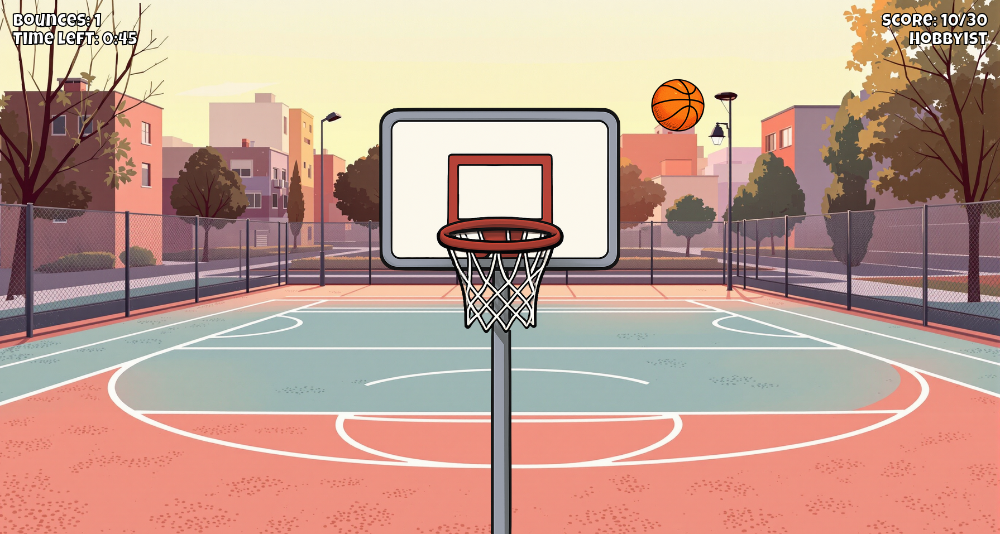

# Yann's Bouncy Basketball

A fun little basketball game written in **vanilla JavaScript** – no frameworks, no libraries, just pure DOM magic.

## 🏀 What is it?

Bounce the basketball off the walls as many times as possible **before** scoring in the hoop. The more bounces, the better your score. The game simulates simple gravity and lets you progress through multiple levels with different balls, gyms, and time limits.

## 🎮 Features

- Pure HTML, CSS & JavaScript (no dependencies)
- Gravity simulation
- Wall-bounce mechanic
- Multiple unlockable levels

## 🚀 Getting Started

1. Clone or download this repo
2. Open `index.html` in your browser

## 🧠 Why?

This project shows what's possible with just vanilla JS – no build tools, no setup, just code and play.
## ⚠️ Disclaimer

All visual assets were generated using **ChatGPT** and **Flux AI**. All sound effects are sourced from **[Pixabay](https://pixabay.com/sound-effects/)** and are free to use.  
